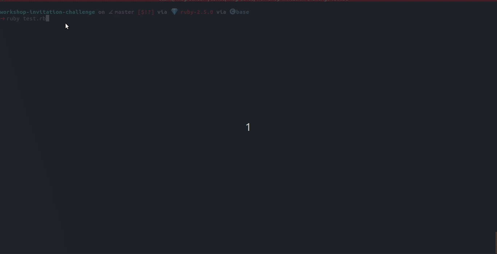
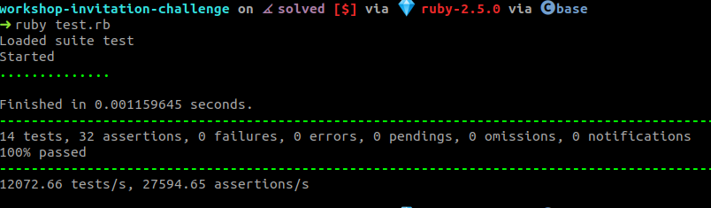

# Workshop Invitation Challenge

- [Challenge](#challenge)
    - [Description](#description)
    - [Git/Github](#git/github-instructions)
    - [Implementing](#implementing-the-challenge)

You need some basic skills to start this challenge: [Dependences](#dependences)

First read all [README](README.md).

## Challenge

### Description

Inside the directory `/lib/` you found some files.

- [circle](lib/circle.rb) [TODO]
- [geometric_base](lib/geometric_base.rb) [DONE]
- [rectangle](lib/rectangle.rb) [TODO]
- [sphere](lib/sphere.rb) [TODO]
- [square](lib/square.rb) [DONE]
- [triangle_rectangle](lib/triangle_rectangle.rb) [TODO]
- [smart_calculator.rb](lib/modules/smart_calculator.rb) [DONE]

Its purpose is to implements correctly the methods that compose files tagged with `[TODO]`.

### Git/Github instructions

#### Fork repository

Access [fork-a-repo](https://help.github.com/en/articles/fork-a-repo) and click on `All` `tab` to see how to do it by graphc interface.

#### Cloning repository

Access [cloning-a-repository](https://help.github.com/en/articles/cloning-a-repository) and follow instructions.

### Implementing the challenge

#### Dependences

- Basic linux commands
- Tech English (???)

##### Ruby

To install ruby with rvm see [RVM](https://rvm.io/rvm/install), and [instlal ruby version](https://rvm.io/rvm/basics#installing-rubies).

#### How can I do it?

You can see [square](lib/square.rb) to based you implementation.

Also there are so many link documentations that you can see:

- https://www.ruby-lang.org/en/documentation/quickstart/
- https://www.tutorialspoint.com/ruby/
- https://devdocs.io/ruby~2.5/
- etc...

OBS: All the tests must be pass to complete the challenge

#### How can I run the tests?

To prove you were able to build the requested `methods` correctly in ruby, you need to run the following tests with:

```sh
$ ruby test.rb
```

If you run without your implemantation you see some like:



What we expect to see when running the tests at the end of your implementation is some like:


